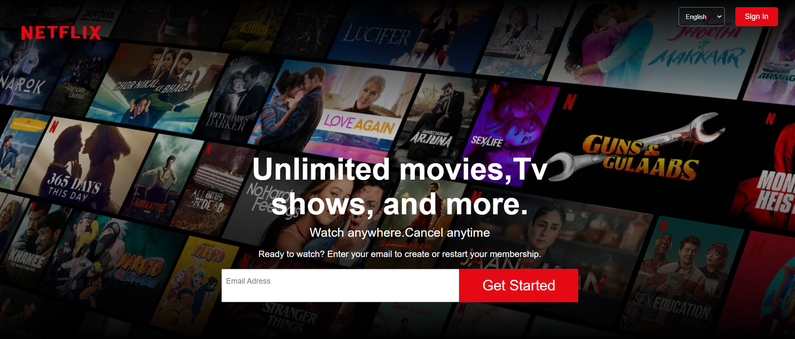
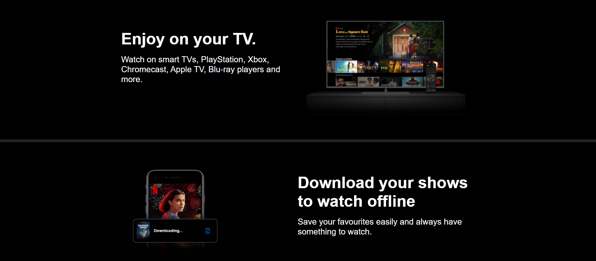
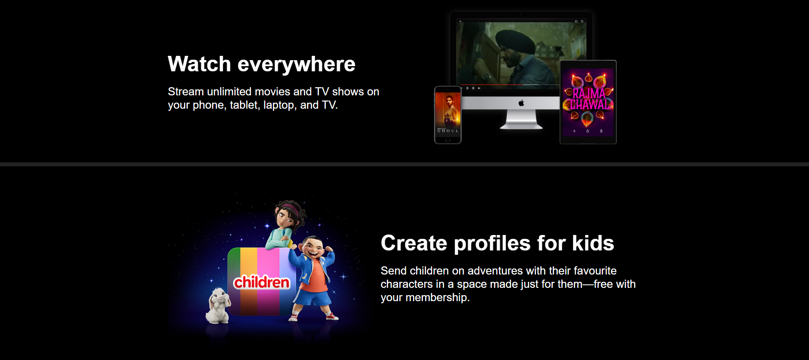
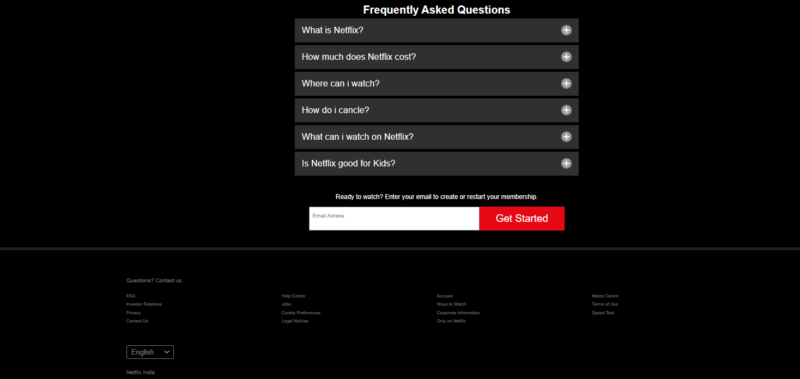

# Netflix-Clone-Responsive
 

## Description:

This project is a clone of the popular streaming service *Netflix*. It has been developed using **HTML, CSS** to replicate the fundamental functionalities and design aesthetics of the original **Netflix website**.

## Special Features:
One of the standout features of this clone is its <b>responsive</b> design. The website is optimized to provide a seamless viewing experience across various devices and screen sizes, ensuring accessibility and usability for all users.

## Application Screenshots:

## Usage:
To access the *Netflix clone, simply open the **index.html* file in any web browser of your choice. There's no need for any additional installations or configurations, making it easy for users to get started immediately.

## Installation:
No installation process is required for this project. Users can clone the repository from GitHub and open the *index.html* file directly in their browser to start exploring the *Netflix clone*.

## Acknowledgements:
This project draws inspiration from the design and functionality of the original Netflix website. It serves as a learning exercise and demonstration of front-end development skills, aiming to replicate a well-known user interface in a personal or educational context.
